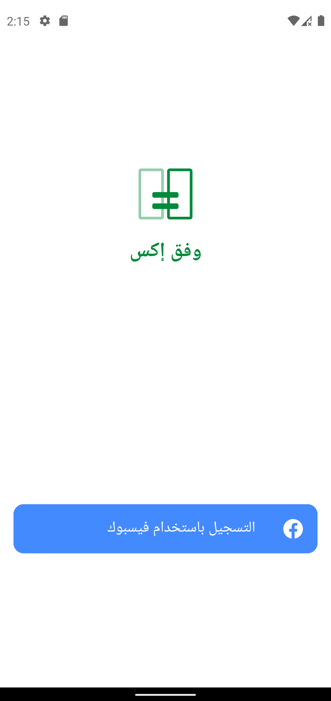
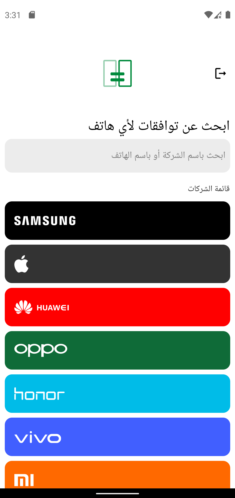
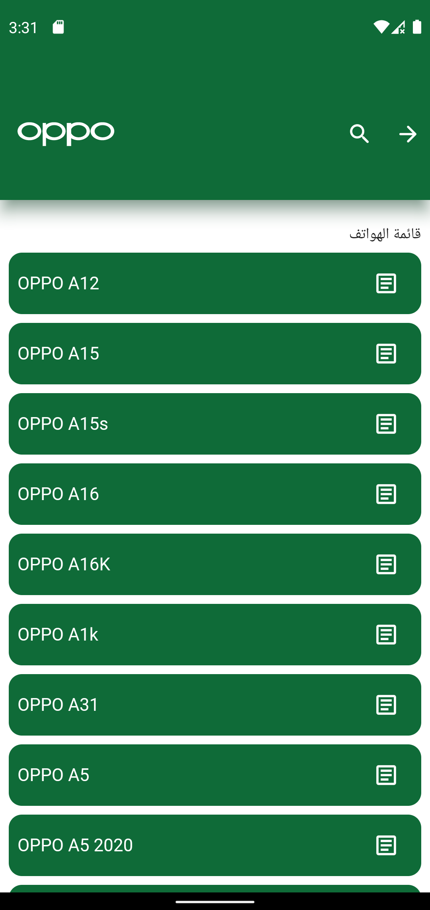
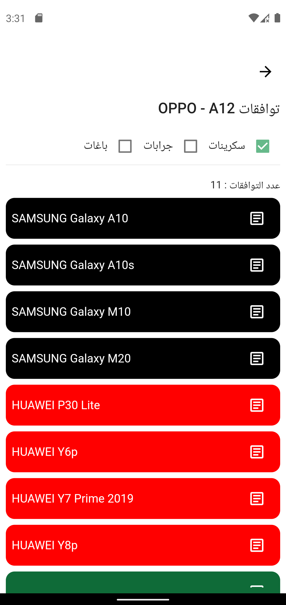
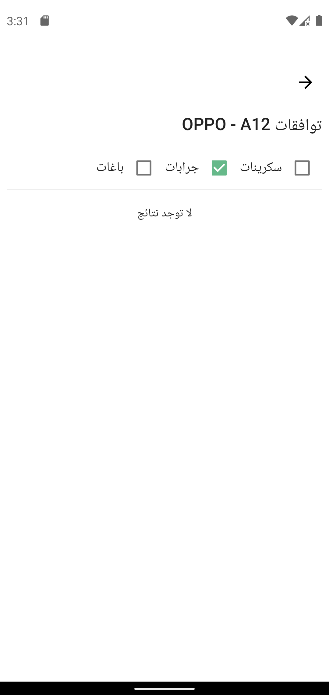
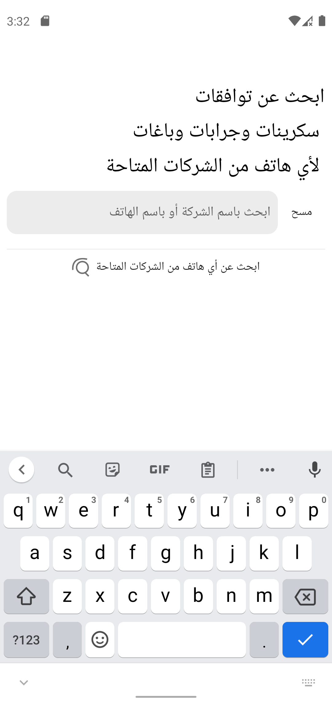
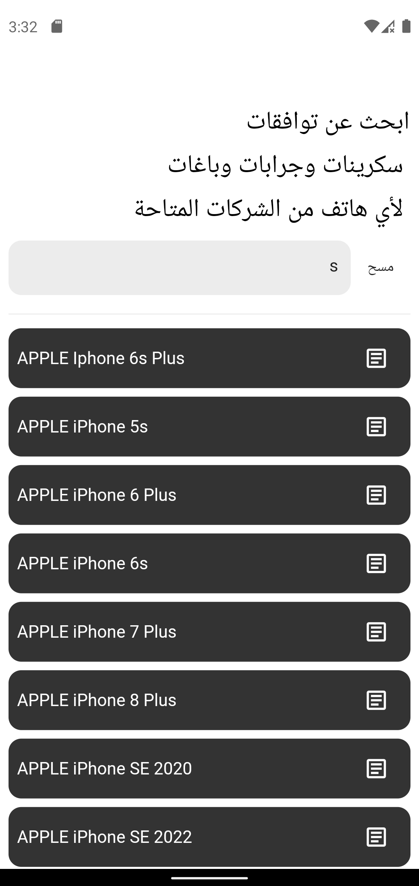

# Waffaq X

Mobile Compatibility Checker is a Flutter app that helps mobile stores find the compatibility of covers and screen protectors for mobiles. It uses Firestore as the backend and for authentication.

## Screenshots

    
    
    
    
    
    
    
    

## Features
* User authentication
* User registration
* User can view compatible covers and screen protectors for a mobile device

## Setup
Clone the project repository.
Navigate to the project directory and run flutter pub get to install the dependencies.
Set up your Firebase project and add your google-services.json file to the android/app directory.
Enable Authentication and Firestore in your Firebase project.
Run the app using flutter run command.

## Project Structure
The project follows the MVC architecture pattern. The folders and files are organized as follows:

* lib/: The main application code
* models/: Contains the data models used in the app.
* controllers/: Handles business logic, including validation, calculations, and data manipulation.
* services/: Contains the classes that interact with Firebase services.
* views/: Contains the screens, widgets and view models for the app.
* utils/: Contains utility classes used throughout the app.

## Dependencies
The following some of dependencies were used in this project:

* flutter_bloc: For state management.
* cloud_firestore: For interacting with Firestore.
* firebase_auth: For authentication with Firebase.
* firebase_storage: For storing and retrieving images from Firebase Storage.
* Freezed: For code generation
* Font Awesome Flutter: For icons
